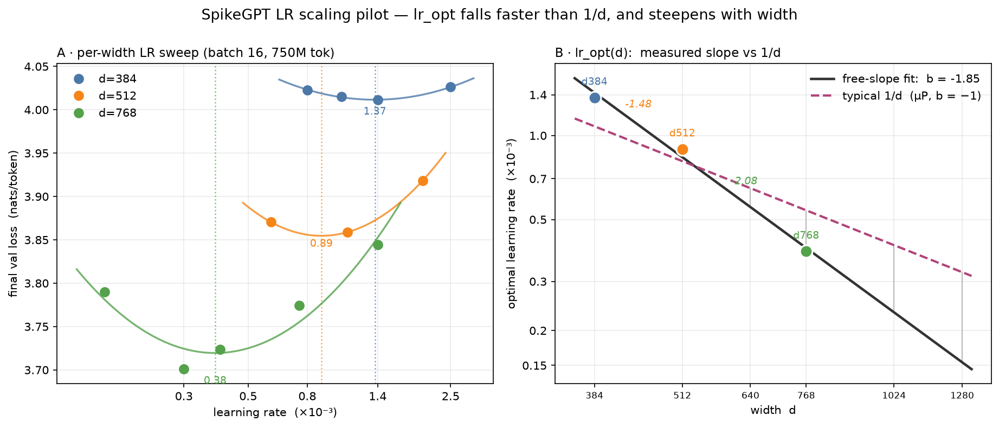

# SpikeGPT scaling-law study

A Chinchilla-style isoFLOP study of the SpikeGPT architecture (spiking RWKV-v4)
on FineWeb-Edu. We fit `L(N, D) = E + A/N^α + B/D^β` on models with non-vocab
`N ≈ 19M–512M`, then extrapolate to the 1B+ regime. All runs are single-GPU
(no DDP), batch 16, ctx 1024, on FineWeb-Edu `sample-100BT` (GPT-NeoX BPE).

Runs stream to **W&B `pitheta/spikegpt-scaling`** — that's where to follow along.

## Files

| file | what |
|---|---|
| `../../src/spikegpt/scaling.py` | exact param / FLOP accounting (`N` = non-vocab params; `C = 6·N_flop·D`) |
| `../scaling_sweep.py` | plan / emit / launch a grid from JSON — backends `modal`, `lambda`, `local` |
| `main_grid.json` | the 18-run isoFLOP grid (4 FLOP tiers × widths d384–1280) |
| `pilot_local.sh` | the LR-rule pilot runner (per-width LR sweeps on the local GPU) |
| `pilot_results.py` | pull finished pilot runs from W&B into a flat table |
| `fit_lr_rule.py` | fit `lr_opt(d) = a·d^b` from the pilot; suggest per-width grid LRs |
| `results/` | the LR-pilot figure + `pilot_results.json` (the fitted outcome below) |

## Result so far: the LR rule

The Phase-1 LR pilot (batch 16, 3 widths × several LRs each) found the optimal
learning rate falls **faster than μP's 1/d**, and steepens with width:

**`lr_opt(d) = 84.95 · d^−1.85`**  (measured vertices 1.37 / 0.89 / 0.38 ×10⁻³ at d384 / 512 / 768)

See `results/lr_pilot_fit.png` and `results/lr_opt_curve.png`. These LRs are baked
into `main_grid.json` (extrapolations to d1024/1280 are provisional).



## Follow along / reproduce

Everything runs through `uv` (GPU deps behind `--extra cuda`). See the repo
`ONBOARDING.md` for environment setup.

```bash
# 1. See the plan — params, tokens, FLOPs, time/cost per run (no GPU needed)
uv run python examples/scaling_sweep.py plan examples/scaling/main_grid.json --eff-tflops 85

# 2. Build a corpus once (single-epoch needs corpus ≥ the run's D; the cheap
#    c3e17 tier fits a 2B prefix, the full grid needs ~16B+):
uv run --extra tokenization python examples/prepare_token_corpus.py \
  --dataset fineweb-edu --hf-config sample-100BT --vocab bpe \
  --max-tokens 2000000000 --output data/fineweb-edu_sample-100BT_2000000000.bin

# 3. Launch a tier on your own GPU (sequential, one run at a time):
export WANDB_ENTITY=pitheta   # or your own entity
uv run python examples/scaling_sweep.py launch examples/scaling/main_grid.json \
  --backend local --filter c3e17 \
  --corpus data/fineweb-edu_sample-100BT_2000000000.bin --yes
```

`emit` (instead of `launch`) prints the commands without running them, so you can
inspect or hand-run a single width. Long runs (the c3e18 / c1e19 tiers) should go
through `examples/run_with_resume.sh` so a crash or reboot resumes from the last
`--checkpoint-out` instead of restarting.

## Hardware notes (RTX 5090, 32 GB)

- **batch 16 is the ceiling at these widths.** d768 peaks at ~97% VRAM; batch 32
  oversubscribes and thrashes. Widths d≥1024 do not fit at batch 16 (need a bigger
  GPU, batch 8, or activation checkpointing).
- **Always pass `--val-eval-tokens`** (the launcher sets 2,000,000). Without it the
  in-loop eval scores the *entire* val holdout every eval and dominates cost.
- First compiled step is slow (`--compile regional` autotuning Triton kernels);
  the launcher uses `--compile-mode default` to skip the long max-autotune.
